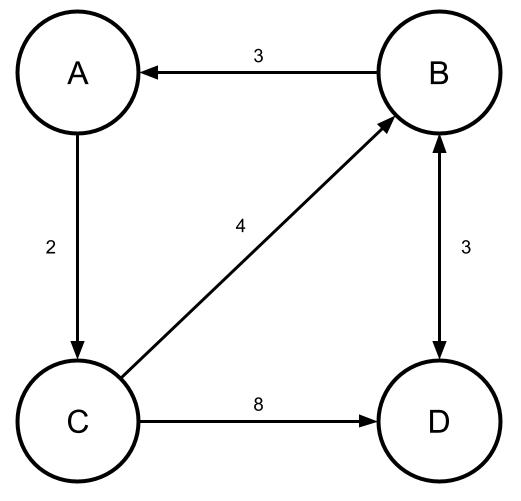
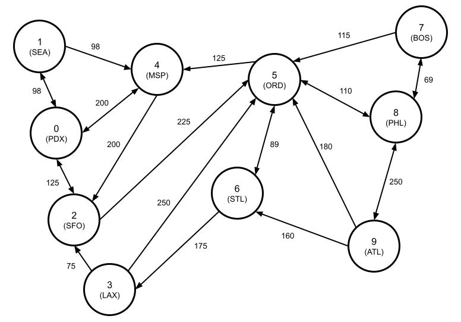

# Assignment 4
**Due by 11:59pm on Monday, 11/29/2021**<br/>
**Demo due by 11:59pm on Friday 12/10/2021**

In this assignment, you will implement a binary heap-based priority queue (PQ).  The requirements for the assignment are described below.

For this assignment, you are provided with some starter code that defines the structures you'll be working with and prototypes the functions you'll be writing and also provides some data structures upon which to build a PQ implementation.  It's important that you don't modify the function prototypes specified in `pq.h`. To help grade your assignment, we will use a set of tests that assume these functions exist and have the same prototypes that are defined in those files. If you change the prototypes, it will cause the tests to break, and your grade for the assignment will likely suffer.

Feel free to add any additional functions you might need to `pq.c`.

## Implement a heap-based priority queue

Your task for this assignment is to implement a [priority queue](https://en.wikipedia.org/wiki/Priority_queue) (PQ).  A PQ is a structure that orders data elements based on assigned priority values.  Specifically, elements can be inserted into a PQ in any order, but when removing an element from a PQ, the highest-priority element is always removed first.

You must build your PQ using a [binary heap](https://en.wikipedia.org/wiki/Binary_heap).  A binary heap is a data structure that takes the form of a binary tree.  There are two different kinds of binary heaps:
  * A minimizing binary heap is organized so that the element with the *lowest* key is always at the root of the tree.
  * A maximizing binary heap is organized so that the element with the *highest* key is always at the root of the tree.
In this assignment, you will specifically base your PQ implementation on a minimizing binary heap.

The interface for the PQ you'll implement (i.e. the structures and the prototypes of functions a user of the PQ interacts with) is already defined for you in the file `pq.h`.  Your job is to implement definitions for the functions that comprise this interface in `pq.c`.

**Note that you may not modify the interface definition with which you are provided.**  Specifically, do not modify any of the already-defined PQ function prototypes.  We will use a set of tests to verify your implementation, and if you change the PQ interface, it will break these tests, thereby (negatively) affecting your grade.  Beyond these things, though, feel free to add any additional functions or structures your PQ implementation needs.  In particular, you'll have to specify a definition of the main PQ structure, `struct pq`, in `pq.c`.

The PQ functions you'll need to implement are outlined briefly below.  All of these functions use the type `struct pq`, which represents the PQ itself and which you'll have to define in `pq.c`.  For more details, including information on function parameters and expected return values, see the documentation provided in `pq.c`.  Here are the functions you'll have to implement:

  * **`pq_create()`** - This function should allocate, initialize, and return a pointer to a new PQ structure.

  * **`pq_free()`** - This function should free all the memory held within a PQ structure created by `pq_create()` without any memory leaks.  Note that this function only needs to free the memory held by the PQ itself.  It does not need to free the individual elements stored in the PQ.  This is the responsibility of the calling function.

  * **`pq_isempty()`** - This function should return 1 if the PQ is empty and 0 otherwise.

  * **`pq_insert()`** - This function should insert a new value with specified priority into the PQ.  **This operation must have O(log n) runtime complexity.**

  * **`pq_first()`** - This function should return the first value (i.e. the highest-priority value) from a PQ *without* removing it.  **This operation must have O(1) runtime complexity.**

  * **`pq_first_priority()`** - This function should return the *priority value* associated with the first element in a PQ *without* removing that element.  **This operation must have O(1) runtime complexity.**

  * **`pq_remove_first()`** - This function should remove the first value (i.e. the highest-priority value) from a PQ and return that value.  **This operation must have O(log n) runtime complexity.**

Your priority queue must be implemented using a minimizing binary heap as the underlying data structure.  This means that within the priority queue you implement, *lower* priority values should correspond to elements with *higher* priority.  In other words, the first element in the priority queue should be the one with the *lowest* priority value among all elements in the collection.  For example, your priority queue should return an element with priority value 0 before it returns one with priority value 10.

In lecture, we'll discuss how you can implement a binary heap using an array.  You are provided with a dynamic array implementation in `dynarray.c` and `dynarray.h` that you can use to implement your heap, if you'd like.  In addition to this dynamic array implementation, you may implement any additional helper functions you need to make your priority queue work.

## Application: Dijkstra's algorithm

One of the most well-known applications of the priority queue data structure is in the implementation of [Dijkstra's algorithm](https://en.wikipedia.org/wiki/Dijkstra%27s_algorithm), which is used to find least expensive paths in a graph data structure.  For example, below is an example of a graph:



In this graph, there are 4 nodes (A, B, C, and D) and there are edges connecting the nodes (the arrows).  Each edge has a cost associated with it indicating how expensive it is to travel on that particular edge.  For example, to move on the edge from C to B has a cost of 4.  Note that the arrows representing some edges in this graph only point in one direction, and one can only travel in the direction indicated by the arrow.  For example, in this graph you can travel directly from B to A (with a cost of 3), but you can't travel from A directly to B.  Instead, to travel from A to B, you must go through C (i.e. taking the path A → C → B) or through both C and D (i.e. taking the path A → C → D → B).

Dijkstra's algorithm is used to find the least expensive path from one starting node to all other nodes in the graph.  For example, starting from node A, Dijkstra's algorithm would find the following least-expensive paths to the other nodes in the graph:
  * **B:** A → C → B with total cost 6
  * **C:** A → C with total cost 2
  * **D:** A → C → B → D with total cost 9

Dijkstra's algorithm is centered around a priority queue, which is used to help order the search for least-expensive paths.  Here's pseudocode for Dijkstra's algorithm, where the starting node is `N_start`:
```
for every node N:
  cost[N] = infinity
  prev[N] = undefined
cost[N_start] = 0

Q = new priority queue
insert N_start into Q with priority 0

while Q is not empty:
  c = Q.first_priority()  // c is the total cost of the path to N
  {N, N_prev} = Q.remove_first()  // N_prev is the previous node on the path to N
  if e < cost[N]:
    cost[N] = c
    prev[N] = N_prev
    for each neighbor N_i of N:  // A neighbor is a node connected to N by an edge
      c_i = cost of edge from N to N_i
      insert {N_i, N} into Q with priority c + c_i  // N is the previous node on the path to N_i
```

At the end of this algorithm, `cost[N]` will contain the cost of the least expensive path from `N_start` to `N`, and `prev[N]` will contain the node before `N` in that path.  The entire path to `N` can be computed by tracing backwards: `prev[N]`, `prev[prev[N]]`, `prev[prev[prev[N]]]`, ...

Your job here is to implement Dijkstra's algorithm to find the shortest paths in the graph specified in the file `airports.dat`.  Here are some things you'll have to do to make this work:

  * Read the data from the file `airports.dat`.  You can use the functions [`fopen()`](https://www.tutorialspoint.com/c_standard_library/c_function_fopen.htm) and [`fscanf()`](https://www.tutorialspoint.com/c_standard_library/c_function_fscanf.htm), respectively, to open and read data from the file.  The file has a special format that will make it easier to read:
      ```
      <num_nodes>
      <num_edges>
      <node_i> <node_j> <cost_i_j>
      ...
      ```

      Specifically, the first line of the file contains the number of nodes `n` in the graph, and the second line contains the number of edges specified in the file.  The remaining lines each specify one edge in the graph.  Each edge specification consists of 3 values:

      * An integer index between 0 and `n-1` representing the source node of the edge (i.e. the edge goes *from* this node).
      * An integer index between 0 and `n-1` representing the destination node of the edge (i.e. the edge goes *to* this node).
      * The cost associated with the edge.

  * Store the graph data you read in an easily usable format.  I'd recommend storing the graph data as an [adjacency matrix](https://mathworld.wolfram.com/AdjacencyMatrix.html).  For a graph with `n` nodes, an adjacency matrix would be an `n` x `n` matrix (i.e. a 2D array), where the entry at location (`i`, `j`) is simply the weight of the edge between node `i` and node `j` or 0 if there is no edge between nodes `i` and `j`.  For example, an adjacency matrix for the graph pictured above would look like this:
      ```
          A  B  C  D
        +------------
      A | 0  0  2  0
      B | 3  0  0  3
      C | 0  4  0  8
      D | 0  3  0  0
      ```

  * Once the graph is read and stored, implement Dijkstra's algorithm as outlined above.  Importantly, you'll have to figure out how to store the necessary data in your priority queue (*hint: storing both the current node and the previous node in your queue will probably require a custom `struct`*).  For this assignment, you can assume that node 0 is the starting node.  In other words, you want to find the least-cost path from node 0 to each other node in the graph.  Once you've found these paths, print them out, along with their total cost.

Below is a depiction of the graph defined in `airports.dat`:



This graph represents a hypothetical set of flights between airports in the US.  In this graph, the nodes represent airports in the US, and each edge weight represents the cost of a flight between two specific airports .  Your goal in finding the least-cost paths using Dijkstra's algorithm here is to figure out the least expensive set of flights to get from PDX to each of the other airports.  (As will become clear once you've solved the problem, we're not necessarily concerned with minimizing the number of layovers here.)

## Testing your work

In addition to the skeleton code provided here, you are also provided with some application code in `test_pq.c` to help verify that your PQ implementation, is behaving the way you want it to.  In particular, the testing code calls the functions from `pq.c`, passing them appropriate arguments, and then prints the results.  You can use the provided `Makefile` to compile all of the code in the project together, and then you can run the testing code as follows:
```
make
./test_pq
```
Example output of the testing program using a correct PQ implementation is provided in the `example_output/` directory.

In order to verify that your memory freeing functions work correctly, it will be helpful to run the testing application through `valgrind`.

## Submission

As always, we'll be using GitHub Classroom for this assignment, and you will submit your assignment via GitHub. Just make sure your completed files are committed and pushed by the assignment's deadline to the master branch of the GitHub repo that was created for you by GitHub Classroom for this assignment. A good way to check whether your files are safely submitted is to look at the master branch of your assignment repo on the github.com website (i.e. https://github.com/osu-cs261-f21/assignment-4-YourGitHubUsername/). If your changes show up there, you can consider your files submitted.

## Grading criteria

To grade your work, the TAs will use the tests in both `test_pq.c`.  Your programs **MUST** compile and run on `access.engr.oregonstate.edu` (or `flip`), so make sure you have tested your work there before you make your final submission, since a program that compiles and runs in one environment may not compile and run in another.  **Assignments that do not compile on `access` or `flip` will receive a grade of 0.**  If you do not have an ENGR account, you can create one at https://teach.engr.oregonstate.edu/.

The assignment is worth 100 total points, broken down as follows:

* 90 points: Correctly implements a priority queue based on a minimizing binary heap
  * 5 points: `struct pq` defines a heap-based priority queue
  * 5 points: `pq_create()` correctly allocates and initializes a heap-based priority queue
  * 5 points: `pq_free()` correctly frees all memory associated with a priority queue (no memory leaks!)
  * 5 points: `pq_isempty()` correctly determines whether a priority queue contains any elements or not
  * 10 points: `pq_first()` correctly returns the first value in a priority queue in O(1) runtime complexity
  * 10 points: `pq_first_priority()` correctly returns priority value associated with the first element in a priority queue in O(1) runtime complexity
  * 25 points: `pq_insert()` correctly inserts a value into a priority queue with the specified priority and restores the heap property as needed in O(log n) runtime complexity
  * 25 points: `pq_remove_first()` correctly removes first element element from a priority queue and returns its value, restoring the heap property as needed in O(log n) runtime complexity

* 10 points: Correctly implements an application that uses Dijkstra's algorithm to find the least-cost paths in the graph defined in `airports.dat`, as described above
